# 

# 

#  Creating a Google Play API Key

## Scriptoria Admin Help

# Introduction

Scriptoria allows the automated publishing of Android apps to the Google Play Store. In order to do this, Scriptoria needs a Google Play API Key from the organization for each Google Play Store account. **Only the owner of the Google Play Developer Account can perform these steps.** This document provides guidance specific to Scriptoria.

Full documentation from Google is available at: [https://developers.google.com/android-publisher/getting\_started](https://developers.google.com/android-publisher/getting_started)

In 2023, Google removed the **API access** page from the Google Play Console. In their documentation (above), they say: "Note: You no longer need to link your developer account to a Google Cloud Project in order to access the Google Play Developer API."

Now you first need to create a Google Cloud Project (one can be used for multiple Google Play Store accounts)

# Steps

## Create a Google Cloud Project

Go to the Google Cloud Console [https://console.cloud.google.com](https://console.cloud.google.com) and either use an existing project or create a new one. You can have more than one Google Play Store configured in a Google Cloud Project. If this is your first time accessing Google Cloud, you will need to read and agree to the Terms of Service.

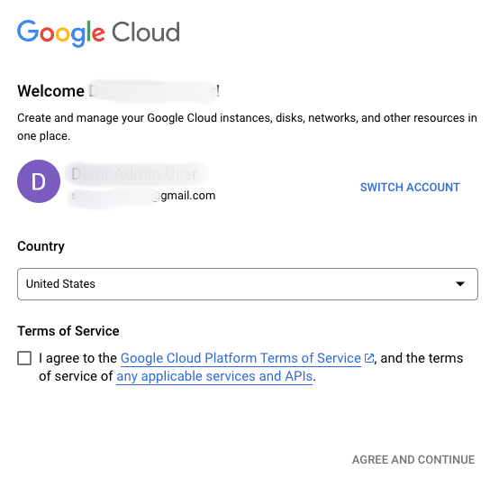   
To create a project:

1. In the menu bar of the website, click on the **Select a project** dropdown.

2. In the **Select a project** dialog, click on the **NEW PROJECT** link

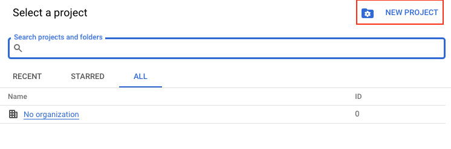

3. In the **New Project** page, enter a Project name (e.g. Google Play Console Developer). You may select an organization or not assign an organization. It is up to you.

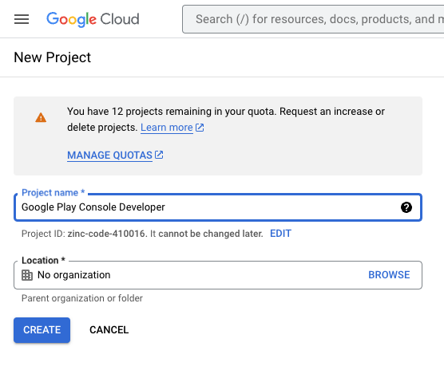

## Select the Project

To select a pre-existing project or the newly created project:

1. In the menu bar of the website, click on the **Select a project** dropdown.

2. In the Select a project dialog, click on the link for the project name.

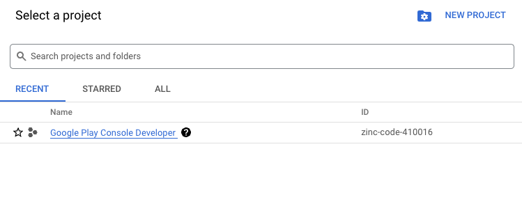
You should now see the project name displayed in the **Select a project** dropdown.

## Enable the API

Once you have set up the Google Cloud Project, you need to enable the Google Play Developer API for this project. This is only for new projects.

To enable Google Play Developer API:

1. Go to the [Google Play Developer API](https://console.developers.google.com/apis/api/androidpublisher.googleapis.com/) page in Google Cloud Console.  
2. Click **Enable**.

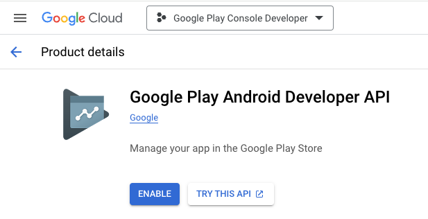

## Create Service Account

For Scriptoria to publish to Google Play on your behalf, you will need to create a service account. A service account is created in the IAM & Admin section of the Google Cloud Console. To navigate to the this section, you can:

1. type "Service Accounts" in search field or 

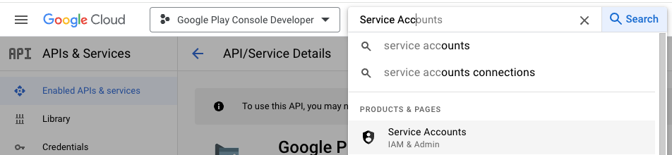

2. click on the search field and then click on **IAM & Admin** in the **POPULAR SEARCHES** list and then select **Service Accounts** from the menu on the left.

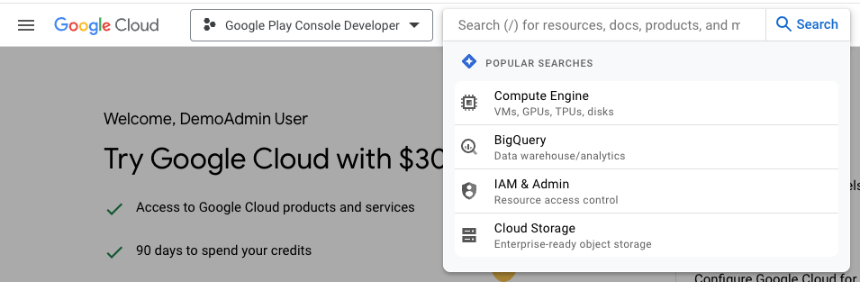

## 

## 

3. Click on **\+ CREATE SERVICE ACCOUNT**

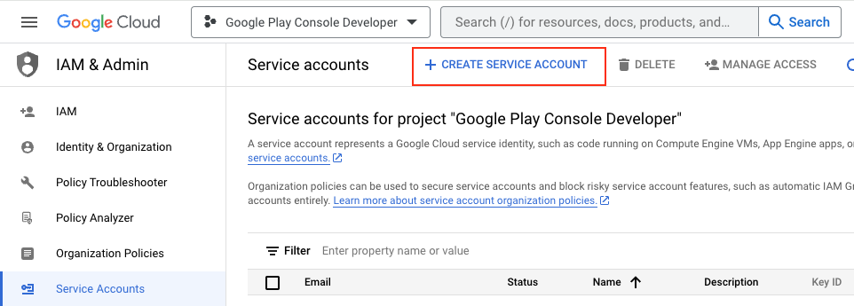

4. Enter a **Service account name** (e.g. YOUR\_ORG\_NAME-scriptoria) and **Service account description** (optional)

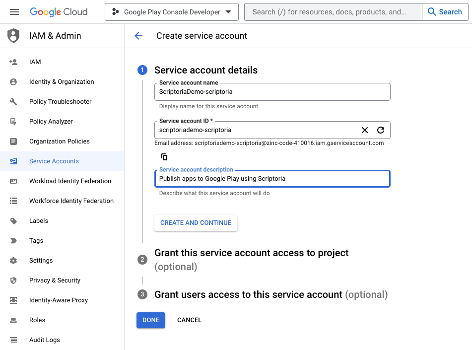

5. Click on **CREATE AND CONTINUE**  
6. Set **Grant this service account access to project (optional)** to **Basic** \> **Owner**   
   

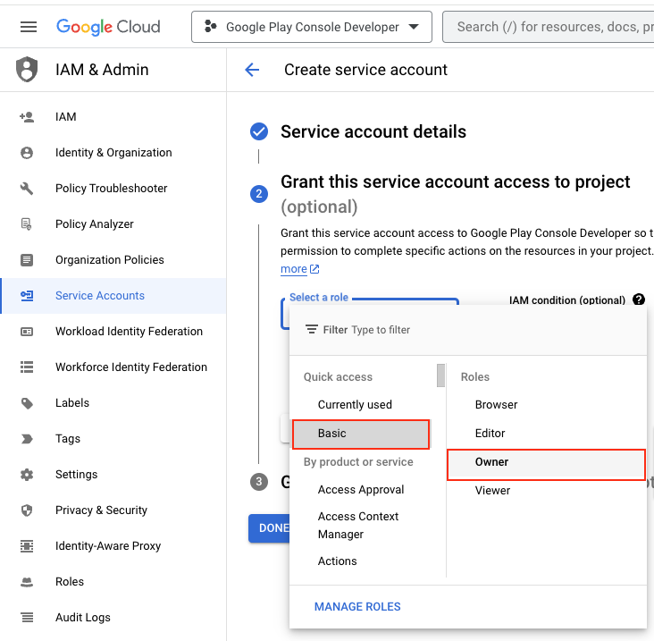

7. Click on **CONTINUE**

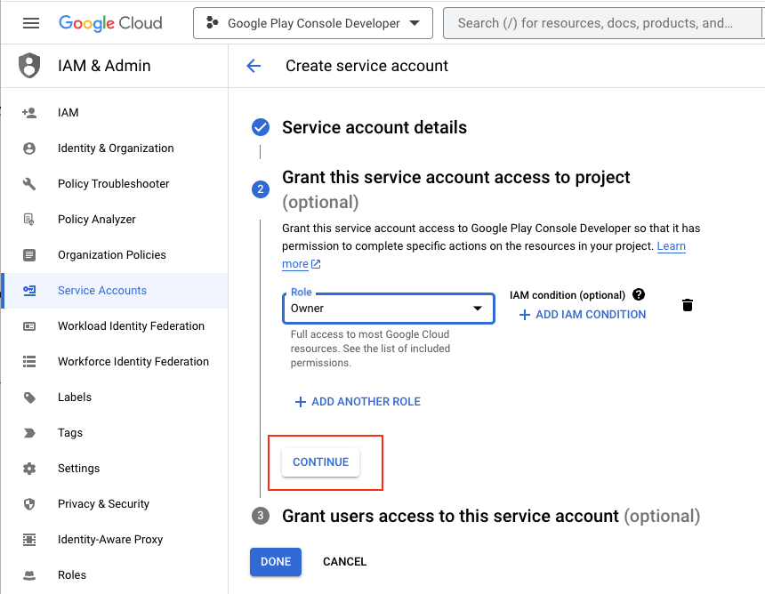

8. Click on **DONE**  
9. On the row with the new service account, click on the vertical dot menu and click on **Manage keys**

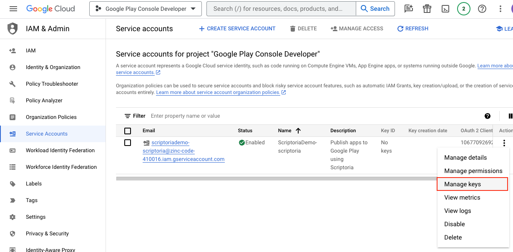

10. On the Keys page, click **ADD KEY** and then **Create new key**

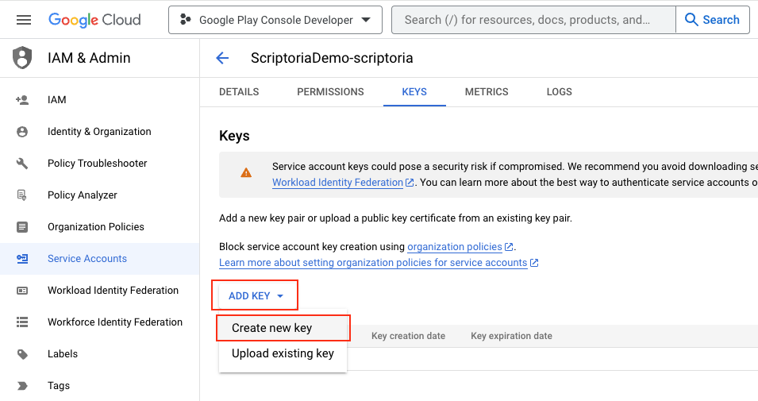

11. Use JSON Key type (default) and click **CREATE** (which will prompt to save a JSON file with the Google Play API Key to your computer).

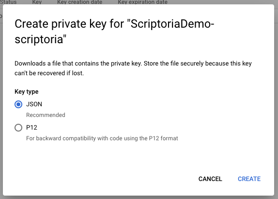

12. Click **Close** on the **Private key saved to your computer** dialog.  
13. Click on the **back arrow** to go back to the list of Service accounts.

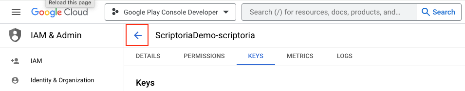

14. Hover your mouse over the Email field of the new Service account and click on the **copy icon** to copy the email address of the service account.

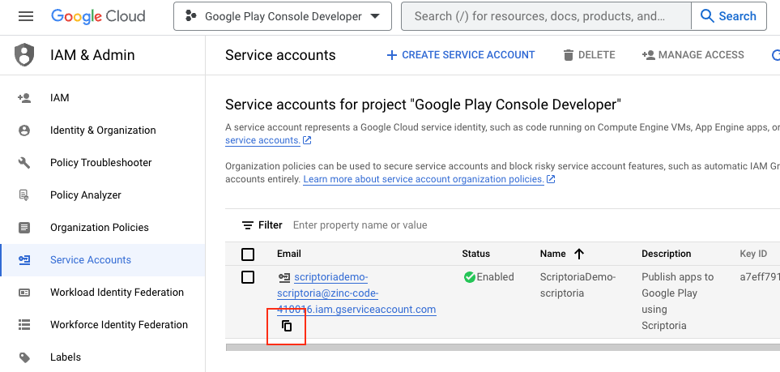

## Invite Service Account to Google Play

Now that you have the service account created and the JSON API Key downloaded, you need to give permission to the service account in your Google Play console.

1. Open the Google Play Developer Console ([https://play.google.com/console/developers](https://play.google.com/console/developers)) for your Google Play Store.  
2. Go to the **Users and permissions** section   
3. Click on **Invite new users** button

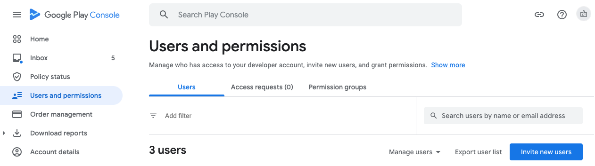
4. Paste in the Email address of the service account into the **Email address** field.  
5. Select **Account permissions** tab and check **Admin (all permissions)**

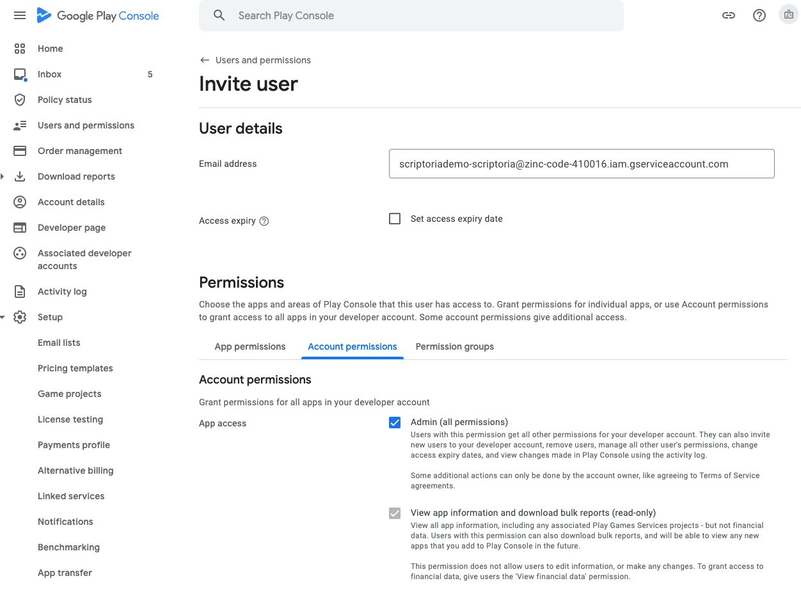

6. Click the **Invite user** button at the bottom of the page.  
7. Click the **Send Invite** button in the **Send invite?** dialog box.

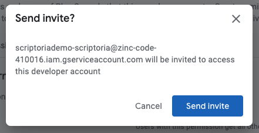

You will be redirected back to the **Users and permissions** list and will see the new entry for the service account email address with the **Active** status.

## Send JSON API Key to Scriptoria

Email the JSON API Key file to the Scriptoria administrator who is assisting with the creation of your Scriptoria account.
