# 

# 

#  Scriptoria Help Guide

Updated: 2025-11-3

[**Introduction**](#introduction)	**[2](#introduction)**

[Roles](#roles)	[2](#roles)

[**Project setup**](#project-setup)	**[3](#project-setup)**

[**Project Detail Overview**](#project-detail-overview)	**[6](#project-detail-overview)**

[**Project Directory**](#project-directory)	**[8](#project-directory)**

[Settings](#settings)	[9](#settings)

[**Publishing Workflow**](#publishing-workflow)	**[9](#publishing-workflow)**

[Google Play Workflows](#google-play-workflows)	[10](#google-play-workflows)

[Product Approval](#product-approval)	[10](#product-approval)

[App Builder Configuration](#app-builder-configuration)	[11](#app-builder-configuration)

[Google Play](#google-play)	[11](#google-play)

[Authors](#authors)	[11](#authors)

[App Store Preview](#app-store-preview)	[12](#app-store-preview)

[Create App Entry](#create-app-entry)	[13](#create-app-entry)

[Verify and Publish](#verify-and-publish)	[14](#verify-and-publish)

[Make it Live\!](#make-it-live!)	[15](#make-it-live!)

[Rebuild and Republish](#rebuild-and-republish)	[16](#rebuild-and-republish)

[Product Workflow Details](#product-workflow-details)	[17](#product-workflow-details)

[**Administration**](#administration)	**[19](#administration)**

[Permission Levels](#permission-levels)	[19](#permission-levels)

[Super Admin](#super-admin)	[19](#super-admin)

[Org Admin](#org-admin)	[20](#org-admin)

[App Builders](#app-builders)	[20](#app-builders)

[**Set up an organization**](#set-up-an-organization)	**[20](#set-up-an-organization)**

[**Add User**](#add-user)	**[23](#add-user)**

[**Manage Users**](#manage-users)	**[24](#manage-users)**

[Modifying a User](#modifying-a-user)	[25](#modifying-a-user)

[Setting User Roles](#setting-user-roles)	[26](#setting-user-roles)

[Setting User Groups](#setting-user-groups)	[26](#setting-user-groups)

# Introduction {#introduction}

Scriptoria is a workflow-based system to manage the publishing of apps to stores and content to websites. The goal is to enable apps to be available to end users to download and use. There are different tasks involved delivering an app to an app store:

* someone needs to collect all the content, contextualize, and design the app  
* someone needs to create the marketing materials (description, screenshots, etc)  
* someone may need to verify that the marketing materials abide by the organization's guidelines  
* someone needs to build the app and manage the signing credentials so that updates can be made in the future  
* someone needs to create the entry in the app store and fill out all the configuration (content rating, target audience, pricing, category, privacy policy, etc).

Depending on the organization, these tasks might be done by different people or they might all be done by the same person. The workflows in Scriptoria have been designed to meet the needs of different organizations. As the workflow progresses, tasks will be assigned to users in different roles to accomplish the process of publishing the app.

## Roles {#roles}

Users in Scriptoria can have different roles which controls which tasks can be assigned to them.

* Author \- can upload/download the project data  
* App Builder \- create and manage projects   
* Organization Admin \- approve projects, perform admin functions, and help if something goes wrong

# Project setup {#project-setup}

In order to create a project, you will need to be a member of a group. If the save button is grayed out after completing all required fields, contact your org administrator to add you to a group. 

To create a project, navigate to “My Projects,” and click “Add Project” in the top right hand corner. 

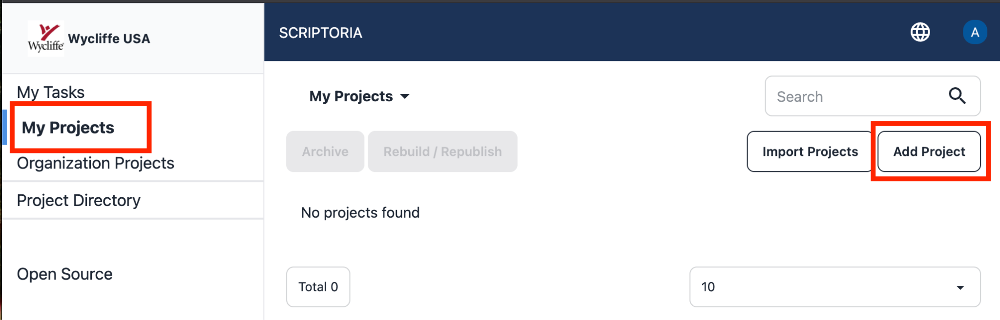

Complete all required fields in the form, click save and your project creation will begin.

*Note: Depending on the workflow, an org admin may need to “approve” the project request*
s
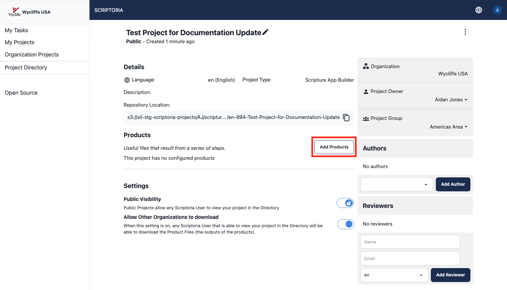

Once your project creation is complete, the “add products” button will be enabled. When the button is clicked, a list of available products for your organization will appear. Only those products available to be published will appear. 

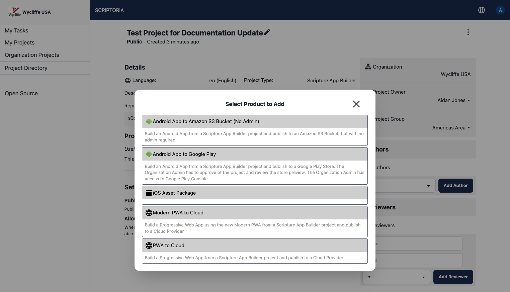
When a product has been selected, the popup will show a list of available stores for your organization and the selected product.   

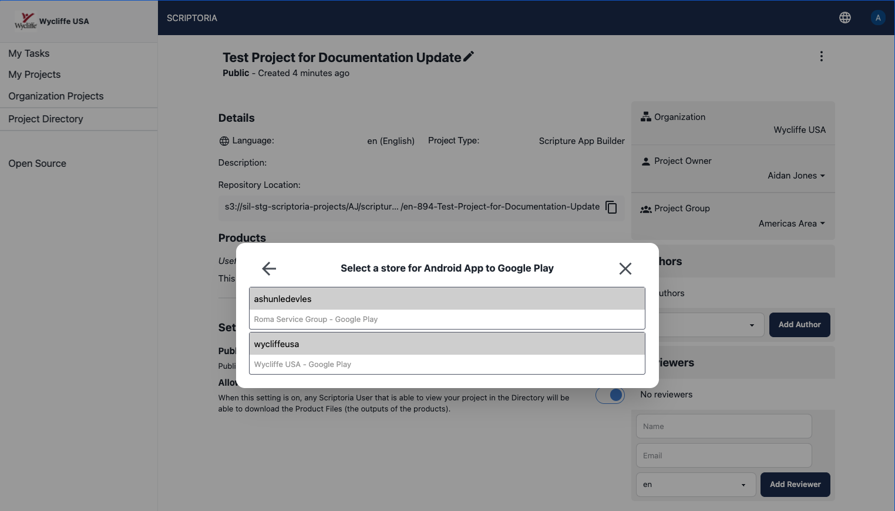
To remove a product, click the “delete product" button in the kebab menu for that product and a confirmation dialog will appear.  
 
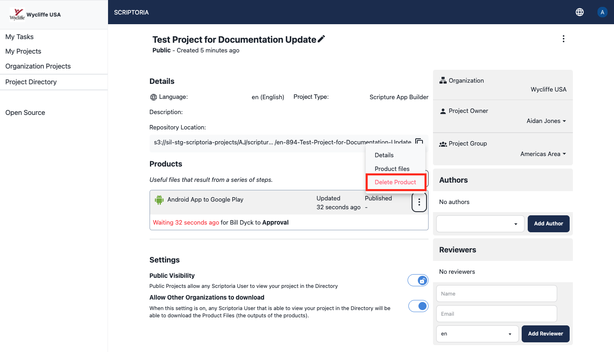

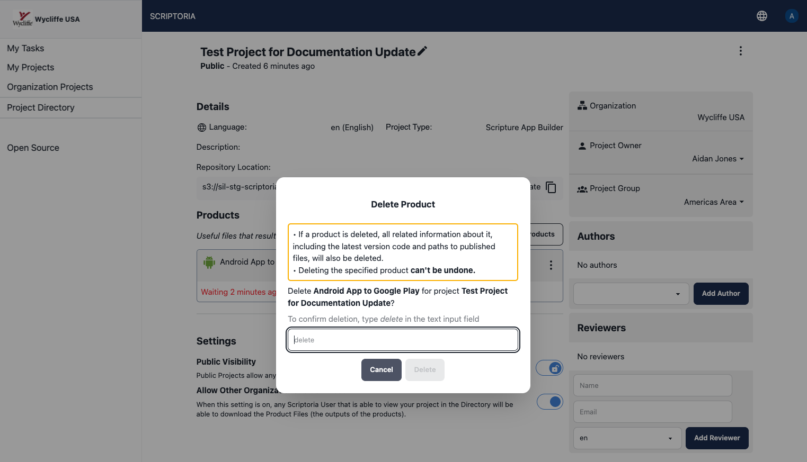
Once you have typed “delete” in the text input of the confirmation dialog, the “delete” button will be enabled. When the “delete” button is clicked, the product is immediately removed.  
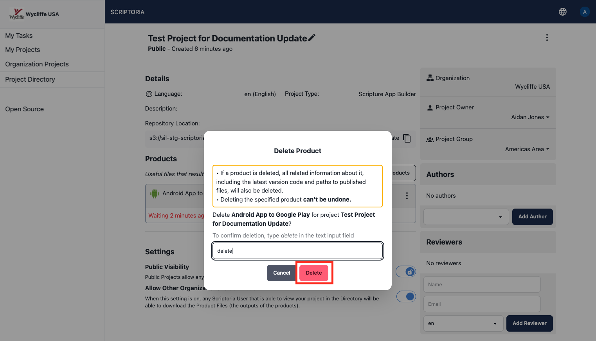

# Project Detail Overview {#project-detail-overview}

As a user, when you click into your project, the view shown below will be displayed. From this view you can view information about your project, view open tasks in the workflow, assign project ownership, move your project to another group, and add reviewers. 

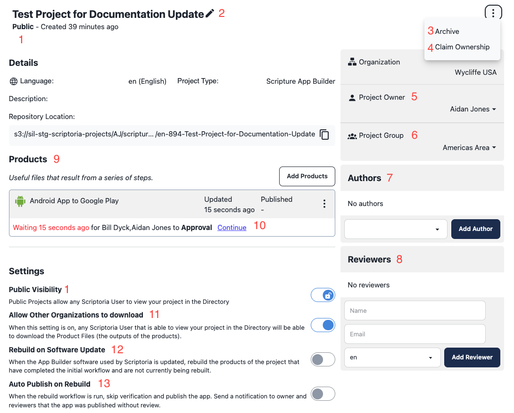

| 1 | Visibility setting | Underneath the project title “public” or “private” will be displayed, which is controlled by the last “public visibility” toggle. When the public visibility toggle is on, users outside your organization will be able to view your project and download related product files. |
| :---- | :---- | :---- |
| 2 | Edit Details | Edit the project name, language code, or description. |
| 3 | Archive | Projects cannot be deleted inside of Scriptoria. Rather, if you no longer wish to see a project in your list of projects, simply archive it and it will disappear from the directory, org projects, and your project list. Archived projects can be reactivated by navigating to my projects- click the dropdown carrot and select “archived projects.”  |
| 4 | Claim Ownership | The project owner receives all tasks & notifications to move a project through the workflow. If the user chooses to claim ownership of the project, they will now be the project owner, receive all task notifications and be responsible for completing all app builder tasks. |
| 5 | Project Owner | The owner of the project who will receive project notifications and be responsible for completing all required steps in the workflow. |
| 6 | Project Group | Project groups are simply a group of users. Project groups are created by the org admin. If there are multiple groups in an organization, the group field will be a dropdown where a project can be moved to another group.  |
| 7 | Authors | Authors are Scriptoria users who can upload/download the project content. |
| 8 | Reviewers | Reviewers are added by name and email. They will receive a link to download the app’s product files for review. There is no additional in-app communication with reviewers. |
| 9 | Products | This is where all products that have been added to a project will appear. Additionally, last updated and published dates will be shown. |
| 10 | Workflow Status and Tasks | Tasks that require action for your products mid-workflow will appear in this section.These same tasks will appear on the “my tasks” page.  |
| 11 | Allow other orgs to download toggle | When this toggle is on, other organization’s users will be able to download your project’s product files. Downloading files will be an “any or nothing” concept. Users can not specify which files will be available to download. |
| 121 | Rebuild on software update toggle | When this toggle is on, administrators for your organization will be able to trigger a rebuild of this project’s products when the App Builder software used by Scriptoria is updated. |
| 131 | Auto publish on rebuild toggle | When this toggle is on, rebuild workflows for products of this project will be automatically published upon a successful build. |

*1\. These toggles may not be visible until the features they control are fully implemented.*

# Project Directory {#project-directory}

The project directory is where all projects across all organizations will appear that are set to public visibility. The project directory can be searched, and additional filters are available. 

## Settings {#settings}

The Project Directory columns can be customized to see additional information about each project and product. See below.   
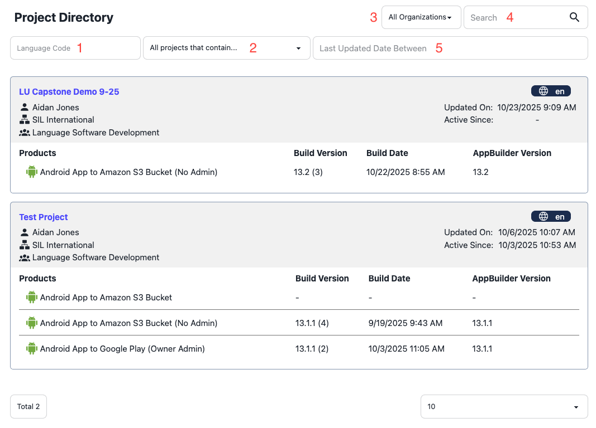

| 1 | Search by Language | Can search by ISO code, list of available languages will auto populate |
| :---- | :---- | :---- |
| 2 | Filter by products | Filter projects by all that contain specified product |
| 3 | Organizations | Filter by organization or view all organization projects |
| 4 | Search | Users can search over the following: Project Name, Language, Owner Name, Org Name, Group Name, and Package Name |
| 5 | Date range | Search projects by “last updated” date range |

# Publishing Workflow {#publishing-workflow}

Once you have added a product to your project, you will begin to be led through a series of steps to complete the workflow resulting in a published product. Tasks will appear both on the “My Tasks” screen, and as individual tasks below your product on the Project Detail page.  

## Google Play Workflows {#google-play-workflows}

Scriptoria was started to simplify the process of publishing Android Apps to Google Play. The original workflow includes all of the workflow steps below. As more organizations started using Scriptoria, there were alternative workflows created to meet the different requirements.

**Android App to Google Play** \- This was the original workflow designed for publishing to the Wycliffe USA store. It contains all of the approval steps. The Organization Admin is responsible for interacting with the Google Play Developer Console. 

* [Workflow Diagram](https://scriptoria.io/docs/Android+App+to+Google+Play.pdf)

**Android App to Google Play (Low Admin)** \- This is a modification of the previous workflow which removes the approval steps. The Organization Admin is still responsible for interacting with the Google Play Developer Console.

* [Workflow Diagram](https://scriptoria.io/docs/Android+App+to+Google+Play+\(Low+Admin\).pdf)

**Android App to Google Play (Owner Admin)** \- This is a modification of the previous workflow which has the Project Owner responsible for interacting with the Google Play Developer Console.

* [Workflow Diagram](https://scriptoria.io/docs/Android+App+to+Google+Play+\(Owner+Admin\).pdf)

These workflows use some or all of the following forms. The workflow for your organization and product may be different.

## Product Approval {#product-approval}

Product approval is the first step in the workflow. An Org Admin must approve your product build request prior to proceeding to the next step.   
*Note, currently if you are an App Builder you would not see the task listed below.  It is only displayed to the assigned user (the Org Admin).*  
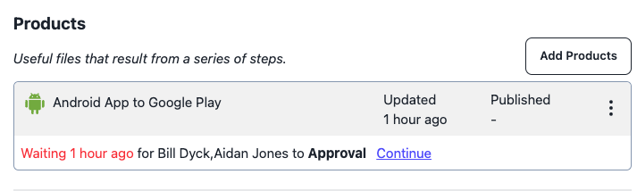

**Approval Screen**  
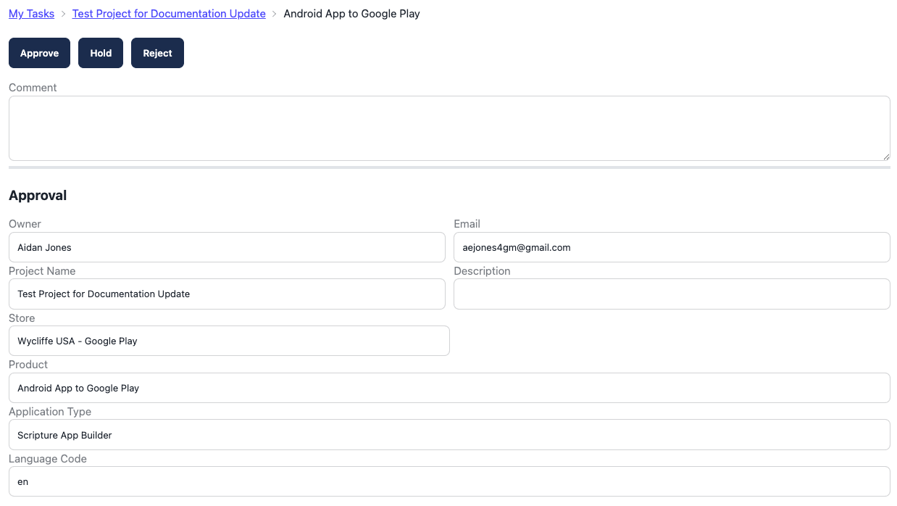
An Org administrator may include a note on your project approval, and if your project is rejected, a note will be required as to why. If the Org Admin selects “hold”, approval is pending.

## App Builder Configuration {#app-builder-configuration}

The next step in the workflow is app builder configuration. The Project Owner will copy the App Project URL to the App Builder desktop app (i.e. Scripture App Builder, Reading App Builder, or Dictionary App Builder) and follow the instructions on the form.

### Google Play {#google-play}

When adding a project that will be published to Google Play, the app might already exist in Google Play and the workflow has to be slightly different. If so, click "Existing App" to continue. If the app is being added to Google Play for the first time, then click "New App" to continue. With an existing app, the App Store Preview, Create App Store Entry and Make It Live steps are skipped.

### Authors {#authors}

The Project Owner can have the Author of the project upload the project by clicking on "Transfer to Authors". The project will be present on the Author's task list. The project will still be present on Project Owner's task list and they will be able to "Take Back" the product if necessary.

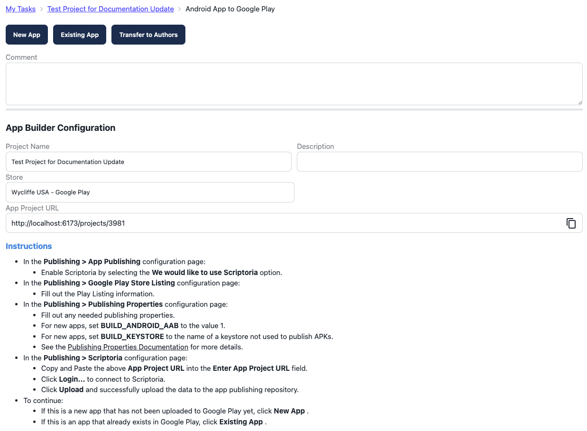

## App Store Preview {#app-store-preview}

The next step in the workflow is the App Store Preview, which will be completed by an Org Admin. The Org Admin will check the product files (apk, about, play-listing preview, etc) to verify that everything is good.  They may reject the project at this point and provide a comment indicating what changes should be made by the Project Owner. ![][image14]

If the Org Admin rejects the current build, then the Project Owner will receive an email and the comment will display in My Tasks. The workflow will be taken back to the Synchronize Data step.  
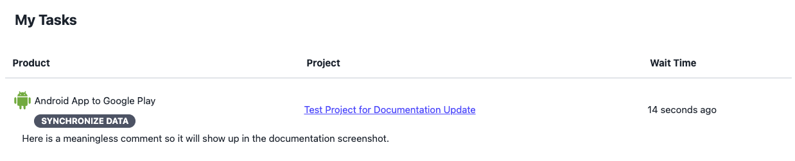

## Create App Entry {#create-app-entry}

The next step in the workflow is creating the app store entry, which will be completed by an Org Admin. In order for apps to be published to Google Play, the Org Admin has to manually enter information into the Google Play Developer Console.  Once this is entered in, Scriptoria can publish updates to the app directly.  
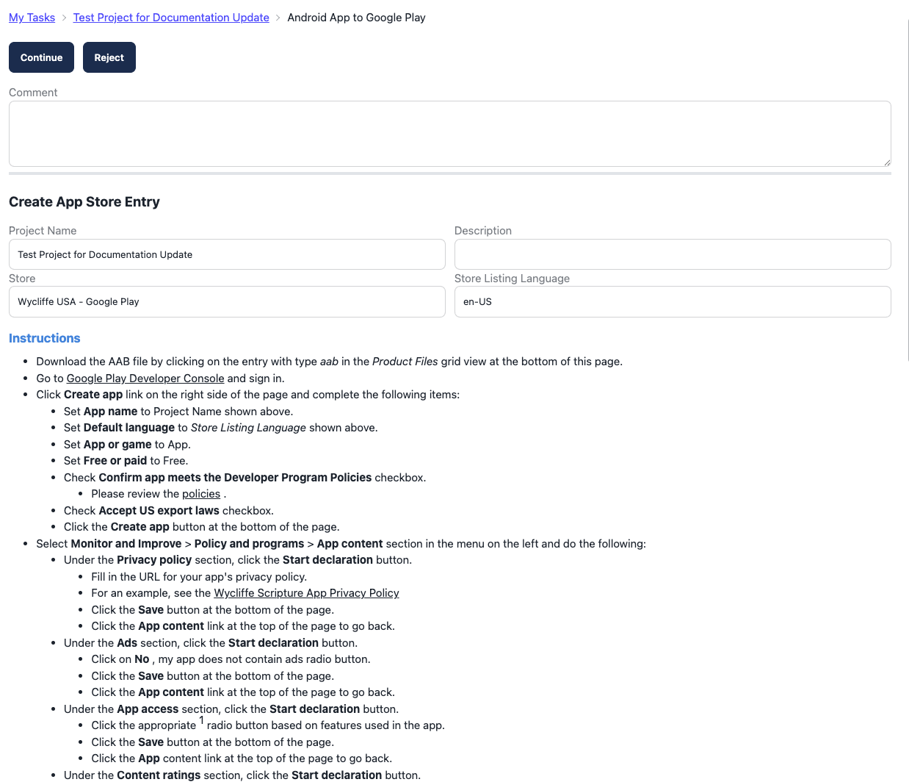

## Verify and Publish {#verify-and-publish}

The Project Owner is responsible for the next step in the workflow, verifying and publishing the product. At this step, the Project Owner should download the built app (for Android apps, that would be the apk) and try it out on their own device.  They should also view the play-listing to preview what the Google Play listing would look like (Note: currently, it is a little behind and needs updating).  
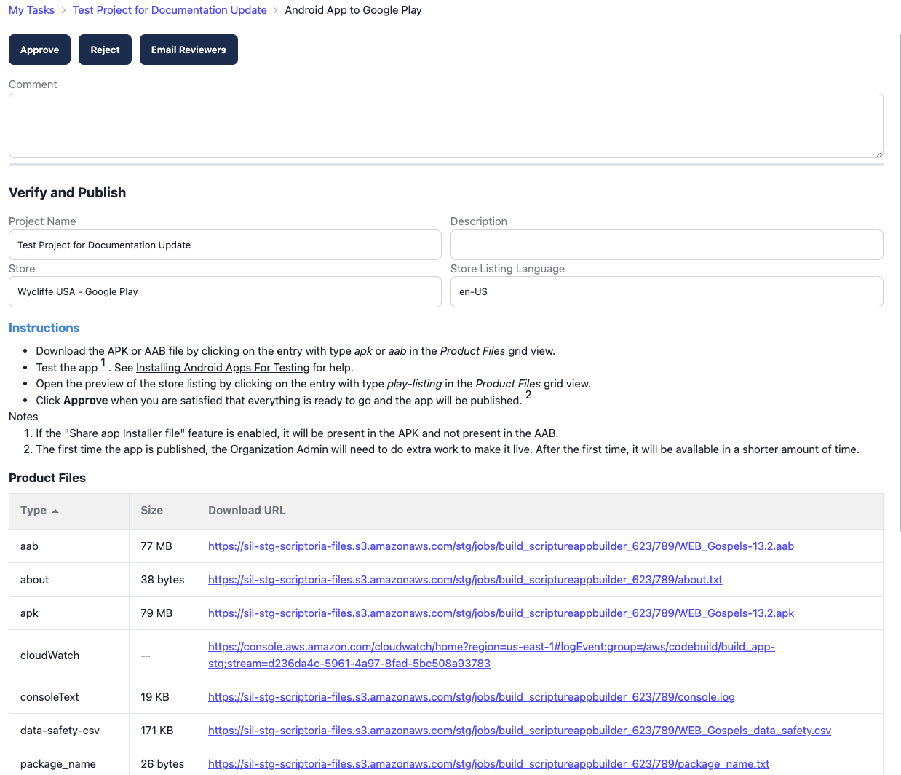

On the project page, there is a place to add reviewers (who don't have to be Scriptoria users).  
At this step, you can click on the Email Reviewers button which will send them an email with a link to download the apk file so that they can review the app as well. This is a good way to obtain feedback from users in the language community of the app.

If the Project Owner finds an issue with the build, they can click the Reject button (and add a comment) and the workflow will return to the Synchronize Data step.  Then the Project Owner can make changes in the App Builder desktop application, send the project data to Scriptoria, and continue with the workflow.

## Make it Live\! {#make-it-live!}

This is the final step of the workflow to have your app published, and will be completed by an Org Admin. There are many configuration settings for the app in the Google Play Developer Console that have to be completed before the app can be made available on the Google Play Store.

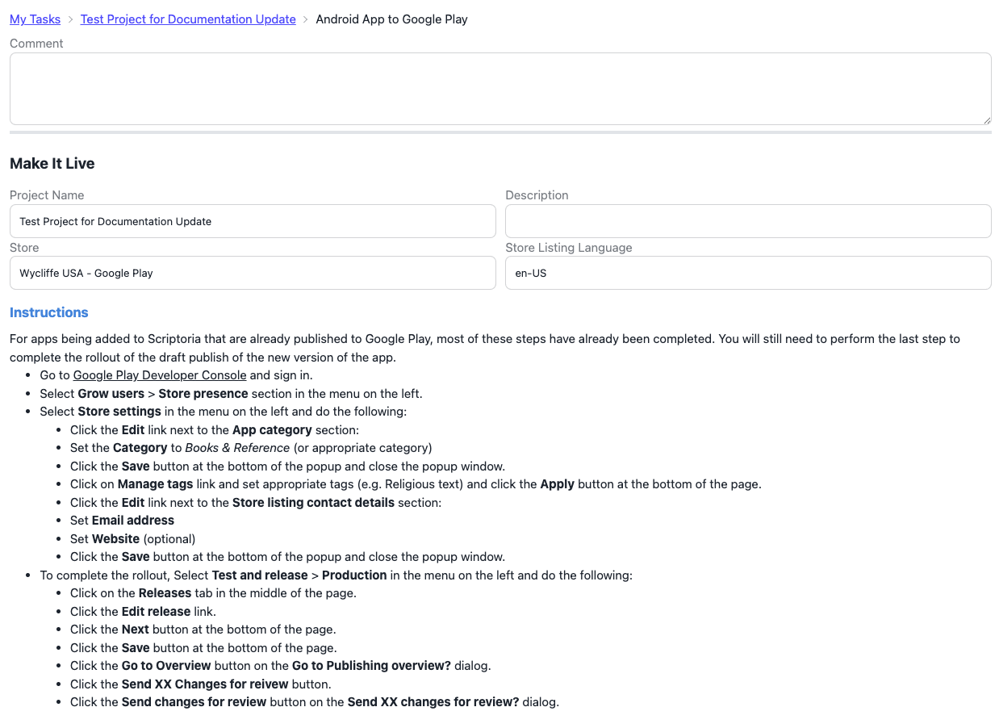

## Rebuild and Republish {#rebuild-and-republish}

Once the app has been published on Google Play, there is a link icon next to the product.  You can click on that link to take you to the app listing on Google Play.

When there are changes that need to be made to the app, you can update the app or the store listing information in the App Builder desktop application and send the changes to Scriptoria. To update Google Play there are two options that are available on the project page: Rebuild and Republish.  Rebuild will do a full build of the app.  If there were only changes to the store listing information, then use Republish which will only update the store listing on Google Play.  These options are available on the kebob menu at the end of the product entry.

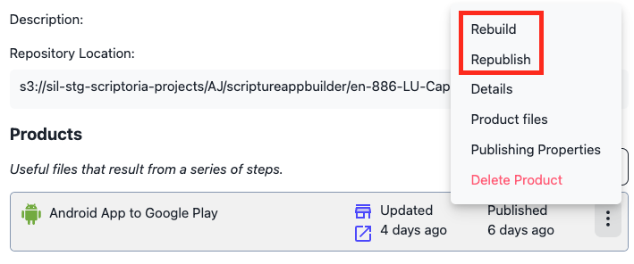

The Rebuild and Republish workflows are a subset of the main workflow and do not require the Org Admin.  If there have been any changes in the Project since the last time it was published, make sure to start the App Builder desktop app and send the project to Scriptoria before starting one of these workflows.  They will immediately start building the app and/or the store listing.  The Project Owner will receive a Verify and Publish task when it is ready.  If there is a problem with the build, the Project Owner can reject the update and the workflow will go to a Synchronize Data step and continue like the main workflow. 

*For additional help, please contact Chris Hubbard.*   
[Chris\_Hubbard@SIL.org](mailto:Chris_Hubbard@SIL.org)

## Product Workflow Details {#product-workflow-details}

A current history of workflow steps for a product can be obtained from the Project Detail Window.  This can be accessed by selecting the “Details” option from the product’s drop down menu..  
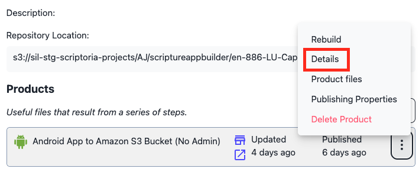

The store name and the list of workflow steps associated with the product are displayed as shown below.  The entries in the list that have dates associated with them are steps that have already been completed.  Entries without a date are the steps that are projected for the path where approvals are granted and builds are successful.  These steps may be changed as the actual path of the product build progresses if these conditions are not met.  Below is an example of a product that has successfully completed the first four steps of the build:

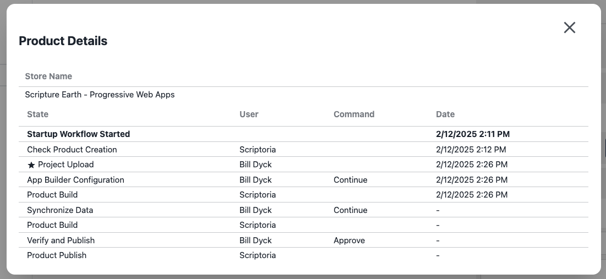

Here is an example of a workflow that is almost completed. When performing a step, the user can enter comments in the comment field.  Those comments are shown for the completed step. The entries with a ★ indicate times that the project was uploaded or downloaded.

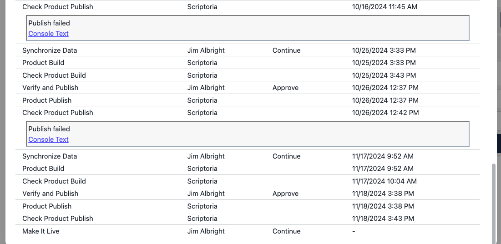

# Administration {#administration}

## Permission Levels {#permission-levels}

There are 3 user permissions levels inside of Scriptoria. The Super Administrator (Super Admin), Organizational Administrator (Org Admin), and App Builders. 

## Super Admin {#super-admin}

Super Admin is the highest level role. They differ in that they are able to make users Org Admins, and are able to:

* Add or edit organizations  
* Add or edit workflow definitions  
* Add or edit product definitions  
* Add or edit stores  
* Add or edit store types

Super admins have all capabilities as Org Admins and App Builders as well. 

## Org Admin {#org-admin}

The majority of Scriptoria users will be App Builders, but every organization will have at least one assigned Org Admin. Organizations may have more than one Org Admin. Org Admins differ from App Builders in that they are able to:

* Invite users to Scriptoria  
* Edit Organization Settings  
  * Org name and logo  
  * Available products to app builders  
  * Available Stores to app builders  
  * Creating and deleting Organizational groups   
    * *Note: users must belong to at least one (1) group to create a project*  
  * Infrastructure settings  
* Control user settings and permissions  
* Approve project build and publish requests\*  
  * *Note: An app builder will not be able to complete the project build workflow without an org admin’s approval*

Org Admins have all access to all other functionality as app builders do. 

## App Builders {#app-builders}

App builders are the primary day to day users of Scriptoria. Inside of Scriptoria they can:

* Create projects  
* Publish products to various stores  
* View all projects inside their organization   
* View all projects in the project directory (public)  
* Download public project’s artifacts  
* Search for projects  
* And more\!

# Set up an organization {#set-up-an-organization}

Any organization can request access to Scriptoria by clicking the “Contact Us” button on the login screen of Scriptoria. An organization must be set up by a Super Administrator (the highest permission level). 

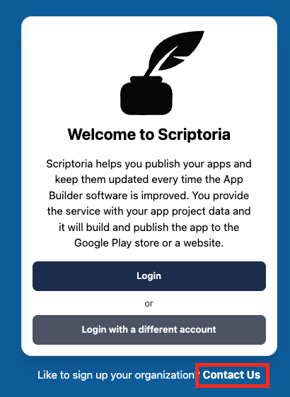

As a Super Admin, to set up an organization: 

* Navigate to “Admin” in the side navigation.   
* Click “Organizations”  
* Click “Add Organization”

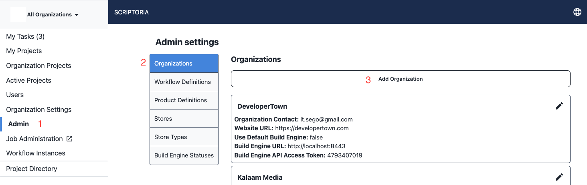

The following information is needed to set up a new organization:

* Organization name  
* Organization Owner (this user will become the organizational admin who is responsible for adding new users and approving project creation requests)  
* Website URL  
* Build Engine URL (optional if Use Default Build Engine is set)  
* Build Engine API Access Token (optional if Use Default Build Engine is set)  
* Logo URL (square format)

The final step is the “Public by Default” toggle. Organization’s projects are defaulted to be public, meaning any project can be viewed in the [project directory](#project-directory) by other organizational users, and they will be able to download the project’s product files. If the public toggle is on, individual projects may still be set to private.   
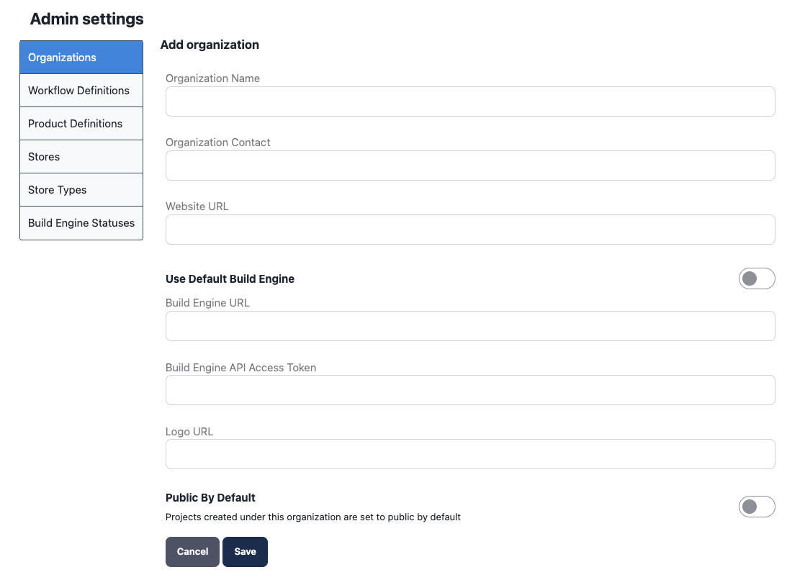

Before your organization’s users will be able to create projects, the Org Admin will need to create “groups” of users. Users can belong to multiple groups. Groups are created in the Org Settings section, and then user membership is managed via the user modal dropdown toggle. Projects can be transferred to other Scriptoria users who belong to your group.

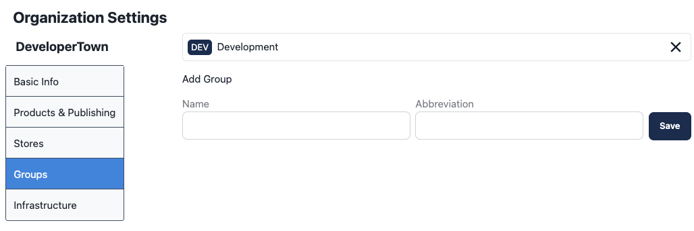

# Add User {#add-user}

The Org Admin should navigate to “Users” then click “Invite User”.  
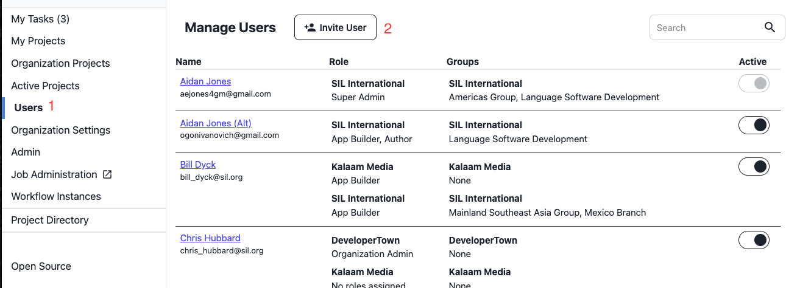

The Org Admin will be shown an Invite User page where they can input an email address, organization, roles, and groups for the invited user.  
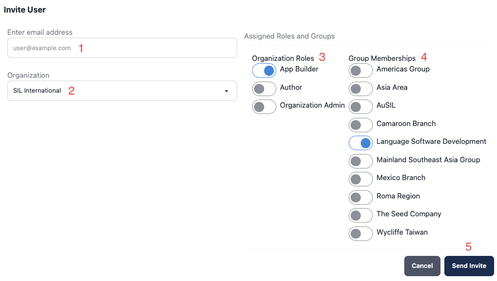

# Manage Users {#manage-users}

On the Manage Users screen, users can be invited, user roles/permissions can be changed, users can be added to groups, and users can be disabled. 

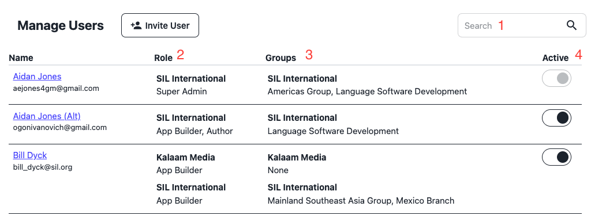

| 1 | Search | Users can be searched |
| :---- | :---- | :---- |
| 2 | Role | This is where Super Admin, Org Admin, and App Builder roles assigned to a user are displayed. In the first example, the user (Chris Hubbard) belongs to two organizations. Users are able to have different roles for different organizations. Note, users can be assigned more than one role.  |
| 3 | Groups | This column displays the groups to which a user is assigned for each organization of which the user is a member.  Users are not assigned to groups automatically when they are added as a user. A user must be assigned a group in order to begin the workflow. Users may be in multiple groups. |
| 4 | Active | When the “active” toggle is turned off, the user will not be able to access Scriptoria. The user will receive a message upon trying to log in to Scriptoria again that they are able to do so, and prompting them to contact their Org Admin. Users who are inactive will not be deleted, and can be reactivated at any time. Users are prevented from locking themselves out of Scriptoria. |

## Modifying a User {#modifying-a-user}

To modify a user’s profile, roles, or group assignments, click on the user’s name in the Manage User screen.  The following screen will be displayed:

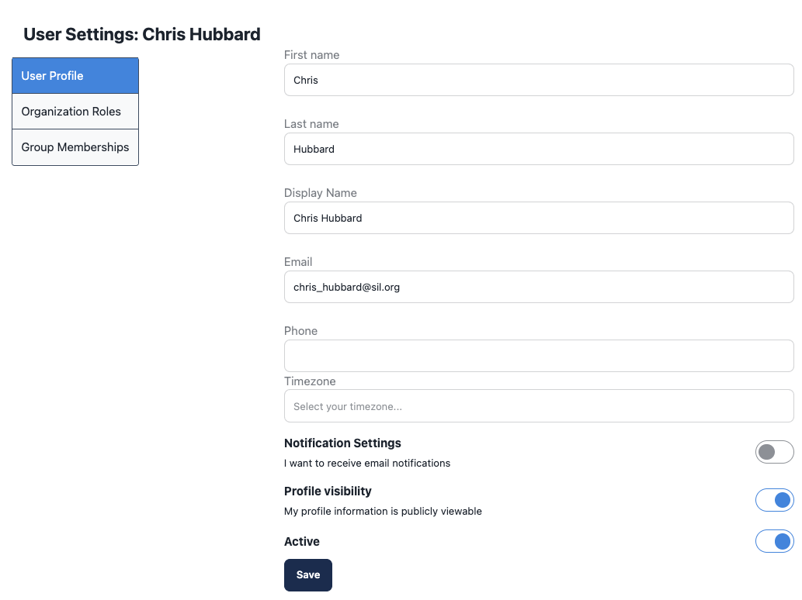
This screen contains three tabs that update the profile, roles and groups associated with the user.  In all cases, the administrator will be able to see all roles and groups associated with the user for any organization the user is a member of.  He may only change those associated with organizations for which he is an administrator.

On this initial tab, the administrator can enter the user’s name, email address, phone number and time zone information.  The toggles specify whether the user wishes to be sent email notifications of outstanding tasks and whether their profile is to be viewable by all users.  The information on this tab may also be entered via the “My Profile” option that displays when the user’s icon is clicked on the top right of the screen.

### Setting User Roles  {#setting-user-roles}

Selecting the “Organization Roles” tab from the above screen displays the role selection tab shown below:  
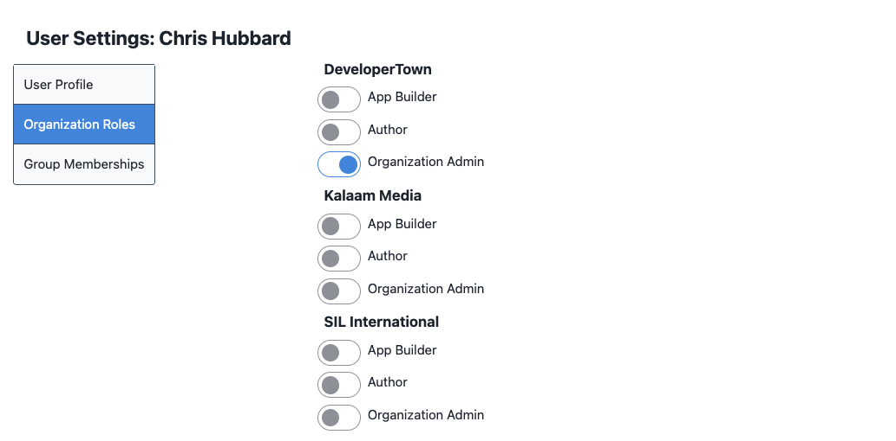
A list as shown above shows the roles to which the user is assigned  for each organization which he is a member of.  The toggle in front of the role may be selected to add or remove that role for this user.

### Setting User Groups {#setting-user-groups}

Selecting the “Group Memberships” tab from this screen displays the group selection tab shown below:  
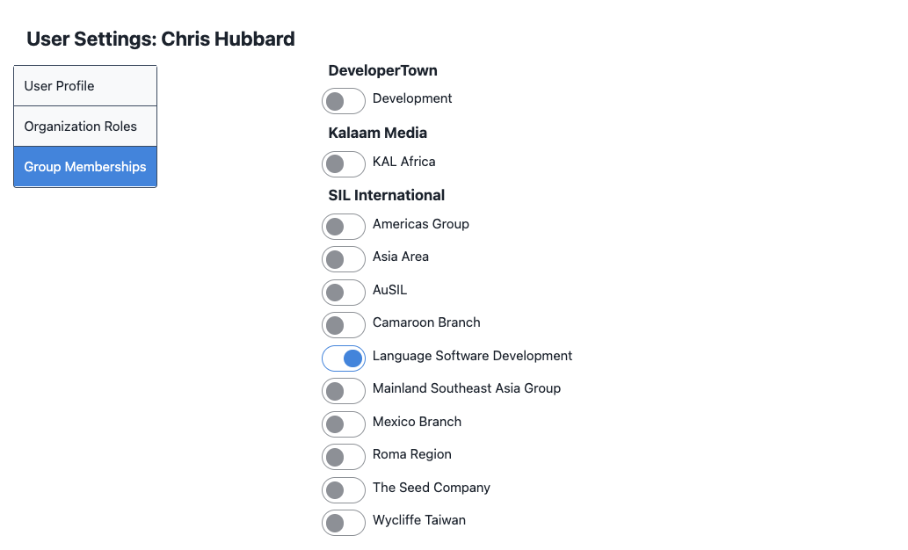
As with the role selection tab, moving the toggle in front of the group’s name adds or removes the user from that group.