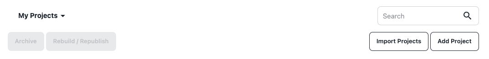
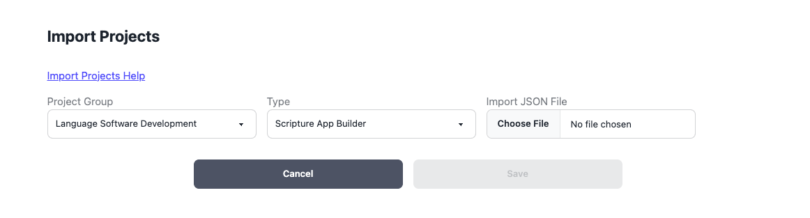
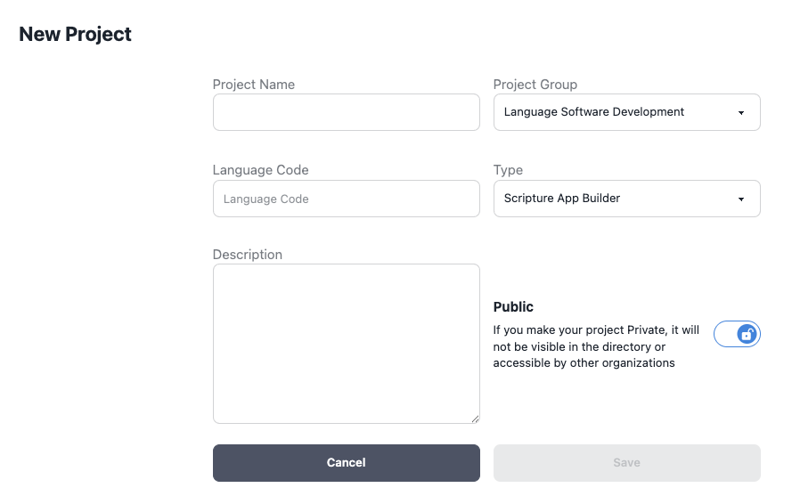
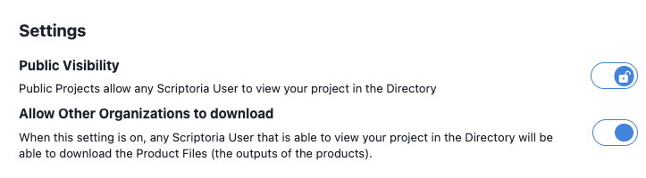

# 

# 

# Scriptoria Project Import

Updated: 2025-11-3

[**Introduction	1**](#introduction)

[**Import Process	1**](#import-process)

[**Import JSON File Format	3**](#import-json-file-format)

[Projects Attributes	3](#projects-attributes)

[Product Attributes	4](#product-attributes)

# Introduction {#introduction}

If you have created many apps and want to use Scriptoria to manage the publishing of the apps, you can import the projects and products into Scriptoria. In Scriptoria, a project is associated with an app project in one of the App Builders (Scripture App Builder, Reading App Builder, or Dictionary App Builder). A project can have multiple products.  A product is defined as the execution of a workflow with the result being published to a store.  Here are a few examples:

Android App to Google Play \= build an Android app from an app builder project with the resulting APK file and metadata being published to Google Play

Android App to S3 Bucket \= build an Android app from an app builder project with the resulting APK file being published to an S3 Bucket

HTML to S3 Bucket \= generate HTML from an app builder project with the result HTML, CSS, and JavaScript being published to an S3 Bucket

# Import Process {#import-process}

To import projects and products into Scriptoria, the project owner should go to the *My Projects* page and click on *Import Projects*. 
  

The owner will specify: Project Group, Application Type, and the Import JSON File and then click *Save*. The project owner will receive an email with the results of the import when it is complete.



# 

# Import JSON File Format {#import-json-file-format}

The Import JSON File Format consists of two arrays of JSON objects: Projects and Products.  For each Project in the Projects array, there will be a Product added (and the workflow started) for each entry in the Products array.  Here is an example JSON file:

```json
{  
   "Projects" : \[  
       { "Name" : "Hindi Bible \- Easy to Read Version",  
         "Description" : "Read and listen to the Word of God in Hindi for free on your Android devices\!",  
         "Language" : "hi",  
         "IsPublic" : true,  
         "AllowDownloads" : true }  
   \],  
   "Products" : \[  
       { "Name" : "Android App to Google Play", "Store" : "fcbh" },  
       { "Name" : "Android App to Amazon S3 Bucket", "Store" : "fcbh\_s3" }  
   \]  
}
```

## Projects Attributes {#projects-attributes}

The project attributes are the same that would be set when adding a new project (Name, Description, Language, and IsPublic) or the settings can be edited when viewing a project (AllowDownloads, IsPublic). The Language attribute should be the BCP-47 language tag. 

New Project Attributes  


Settings Attributes



## Product Attributes {#product-attributes}

The product attributes are the names associated with the Products and Stores that are available to the organization in the Organization Settings. Please contact the Organization Admin or Scriptoria Admin to determine the available values.
